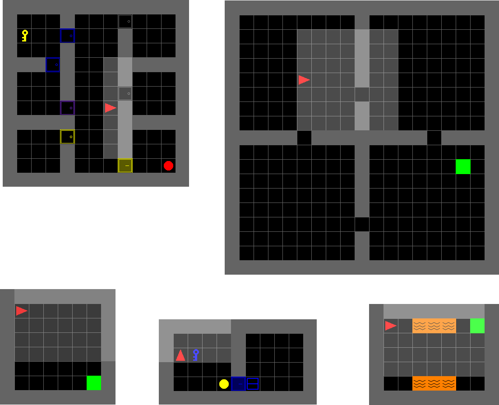
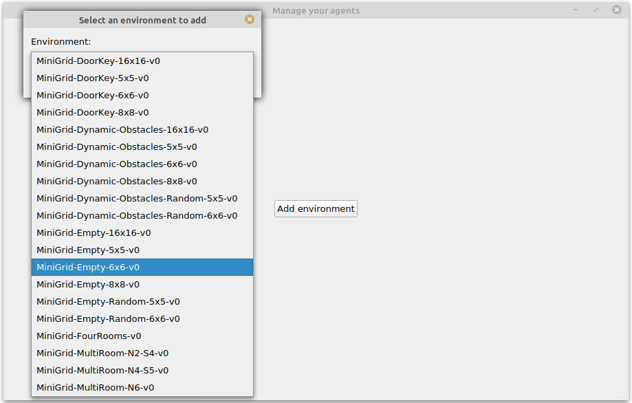
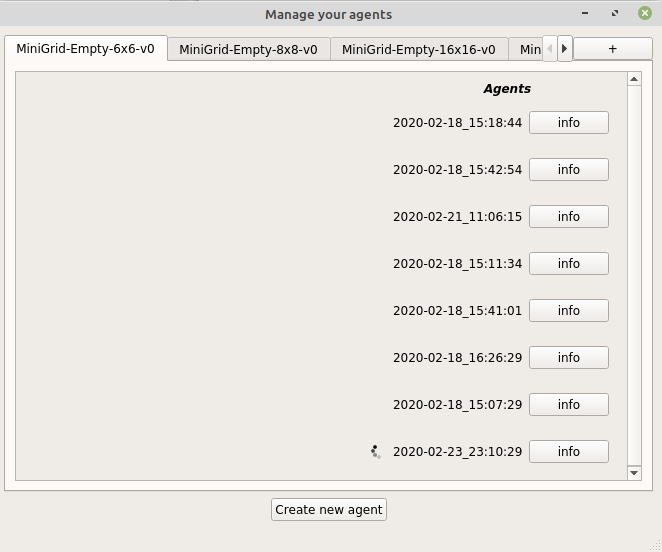
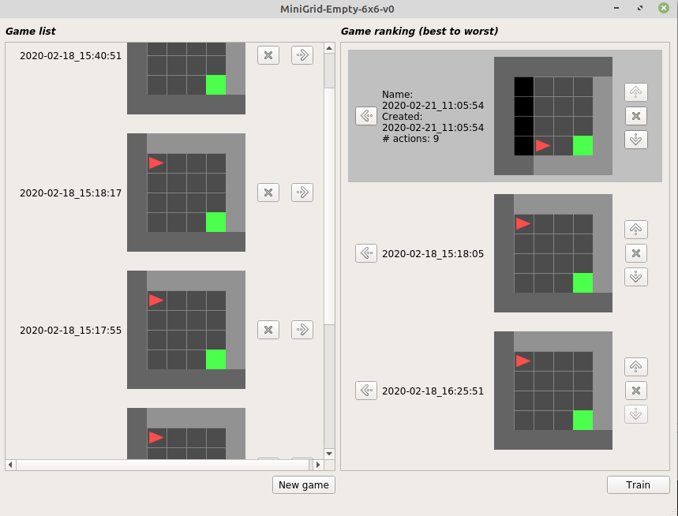
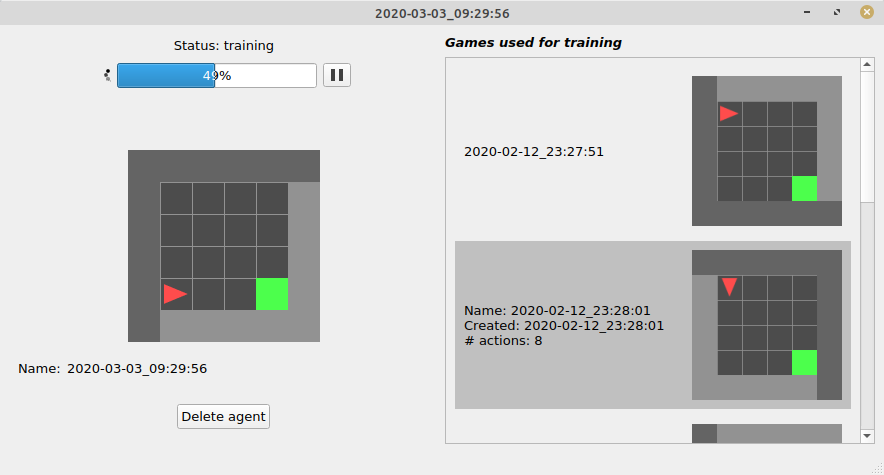
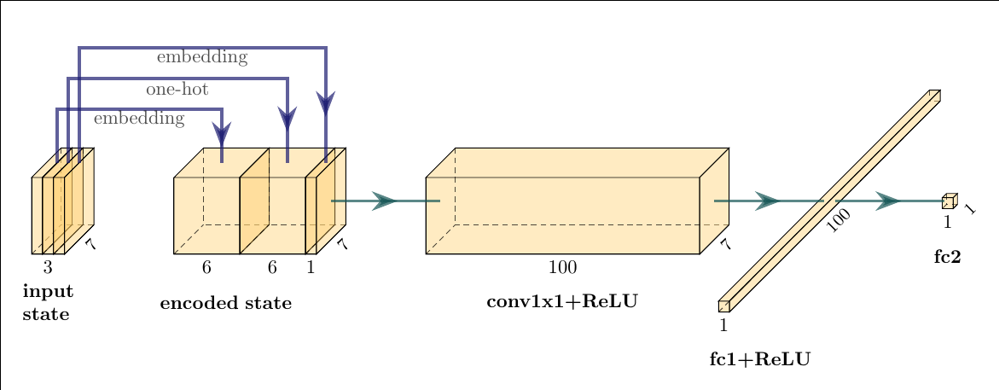
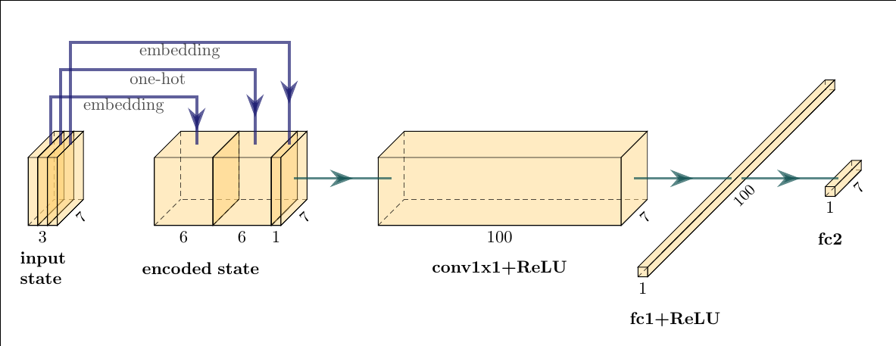
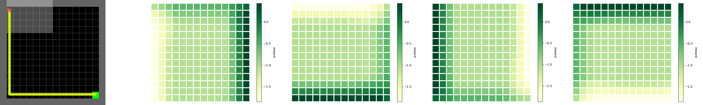

# Inverse Reinforcement Learning on Minigrid

The aim of this project is to provide a tool to train an agent on Minigrid. The human player can make game demonstrations and then the agent is trained from these demonstrations using Inverse Reinforcement Learning techniques.

The IRL algorithms are based on the following paper:
*Extrapolating Beyond Suboptimal Demonstrations via Inverse Reinforcement Learning from Observations*
[[1]](#Trex).

## Usage Notes
### Installation
1. `git clone` this repo
1. `conda create -n venv_irl python=3.9`
1. `conda activate venv_irl`
1. Install [pytorch](https://pytorch.org/)
1. `conda install -c anaconda pyqt`
1. cd to repo root
1. `pip install -e .`
   
### Collect data and train an aagent
1. Run `python agents_window.py`
1. Press `Add environment`, then select from the drop-down
1. Press `Create new agent`
1. Add some demonstrations:
    1. Press `New game`
    1. Control the agent: WASD/arrow keys to move, 'p' to pickup, 'o' to drop, 'i' or space to interact (e.g. with a door), backspace/delete to reset
        1. Commands are defined in `play_minigrid.py`, `qt_key_handler`
    1. When you finish the episode, the `Save` button will activate -- press it to save the demonstration
    1. Collect at least 2 demonstrations
1. Press the -> button next to each demonstration to add it to the list that will be used for training (rank as described)
1. Press `Train` to start training
1. To see training progress and example runs, press "Info" next to the agent in the Agents list
1. See training plots:
    1. In a terminal, cd to repo root
    1. run `tensorboard --logdir data --port 6006`
    1. In a browser, navigate to `localhost:6006`

## MiniGrid environment
Gym-minigrid [[2]](#minigrid) is a minimalistic gridworld package for OpenAI Gym.

There are many different environments, you can see some examples below. 

The red triangle represents the agent that can move within the environment, while
the green square (usually) represents the goal. 
There may also be other objects that the agent can interact with (doors, keys, etc.) each with a different color.

## Graphical Application
The graphical interface allows the user to create, order and manage a set of games
n order to create an agent that shows a desired behavior.
Below you can see the application windows.
### Initial window
Choose an environment to use

### Agents management
Browse list of created agents

### New agent
Add demonstrations and create a new agent

### Agent details
Check trained agent

## Neural Networks
### Reward Neural Network
Architecture of the Reward Neural Network:
+ input: MiniGrid observation 
+ output: reward

Trained with T-REX loss. [[1]](#Trex)

### Policy Neural Network
Architecture of the Policy Neural Network:
+ input: MiniGrid observation
+ output: probability distribution of the actions

Trained with loss:  -log(action_probability) * discounted_reward

## Experiments & results
We made a set of demonstrations to try to get the desired behavior shown on the left in the image below.

Next, the heatmaps of the rewards given by the trained reward network are shown. The different heatmaps represent different directions of the agent, in order: up, right, down, left.

## Run the project
- go to the directory in which you have downloaded the project
- go inside Minigrid_HCI-project folder with the command: `cd Minigrid_HCI-project`
- run the application with the command `python agents_window.py`

## References
<a id="Trex">[1]</a>
Daniel S. Brown, Wonjoon Goo, Prabhat Nagarajan, Scott Niekum.
Extrapolating Beyond Suboptimal Demonstrations via Inverse Reinforcement Learning from Observations. (Jul 2019)
[*T-REX*](https://arxiv.org/pdf/1904.06387.pdf)

<a id="minigrid">[2]</a>
Chevalier-Boisvert, Maxime and Willems, Lucas and Pal, Suman.
 Minimalistic Gridworld Environment for OpenAI Gym, (2018) 
 GitHub repository [Gym-minigrid](https://github.com/maximecb/gym-minigrid)